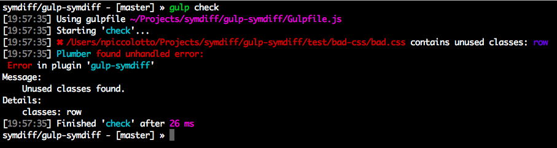

# gulp-symdiff

 

## Installation

~~~ console
$ npm install gulp-symdiff --save-dev
~~~

Depending on what you want, you also have to install by your own the symdiff plugins, like:

~~~ console
$ npm install symdiff-html symdiff-css --save-dev
~~~

## Usage

~~~ javascript
var symdiff = require('gulp-symdiff'),
    html    = require('symdiff-html'),
    css     = require('symdiff-css');

gulp
    .src(['src/*.css', 'src/*.html'])  // ALL the files
    .pipe(symdiff({
        templates: [html],  // list all templates plugins
        css: [css]          // list all css plugins
    })
    .on('error', function() {
        process.exit(1);    // break the build
    }))
~~~

## License

Apache 2
